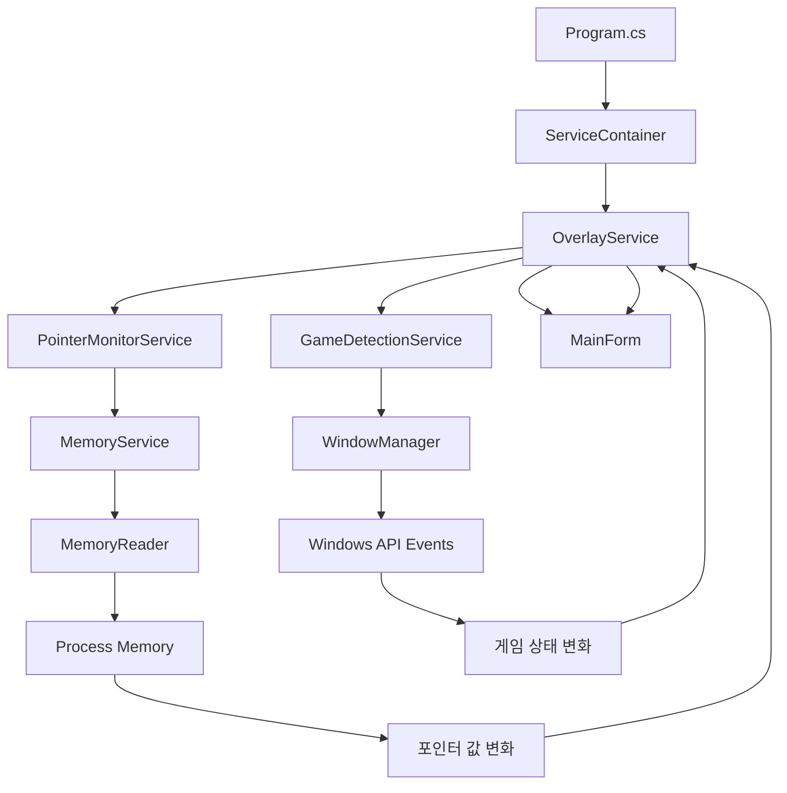

# StarcUp 코드 플로우 문서

## 🔄 전체 아키텍처 흐름

```
Program.cs (진입점)
    ↓
ServiceContainer (DI 컨테이너)
    ↓
OverlayService (메인 컨트롤러)
    ↓
├── GameDetectionService ← WindowManager
├── PointerMonitorService ← MemoryService ← MemoryReader  
└── MainForm ← OverlayControl
```

## 🚀 애플리케이션 시작 플로우

### 1. Program.cs → 진입점

```csharp
Main()
├── ServiceContainer 생성
├── RegisterServices() 호출
├── OverlayService.Start() 호출
└── Application.Run() (메시지 루프)
```

### 2. ServiceContainer → 의존성 주입

```csharp
RegisterServices()
├── MemoryReader 등록 (싱글톤)
├── WindowManager 등록 (싱글톤)
├── MemoryService 등록 (MemoryReader 주입)
├── GameDetectionService 등록 (WindowManager 주입)
├── PointerMonitorService 등록 (MemoryService 주입)
└── OverlayService 등록 (모든 서비스 주입)
```

### 3. OverlayService.Start() → 메인 컨트롤러 시작

```csharp
Start()
├── MainForm 생성 (처음엔 숨김)
├── GameDetectionService.StartDetection() 호출
└── 이벤트 구독 완료 상태로 대기
```

## 🎮 게임 감지 플로우

### 4. GameDetectionService → 게임 프로세스 감지

```csharp
StartDetection()
├── Timer 시작 (1초마다 CheckForStarcraft 실행)
├── WindowManager.SetupForegroundEventHook() 호출
└── 스타크래프트 프로세스 검색 시작

CheckForStarcraft() [타이머 이벤트]
├── Process.GetProcessesByName("StarCraft") 검색
├── 발견되면 GameInfo 객체 생성
├── WindowManager.SetupWindowEventHook() 호출
└── GameFound 이벤트 발생 → OverlayService로 전달
```

### 5. OverlayService → 게임 발견 처리

```csharp
OnGameFound()
├── PointerMonitorService.StartMonitoring() 호출
├── MainForm.UpdateStatus("게임 연결됨") 호출
└── ShowOverlay() 호출 → MainForm.Show()
```

## 🧠 메모리 모니터링 플로우

### 6. PointerMonitorService → 포인터 값 모니터링

```csharp
StartMonitoring()
├── MemoryService.ConnectToProcess() 호출
├── MemoryService.GetStackStart() 호출
├── Timer 시작 (100ms마다 MonitorPointerValue 실행)
└── 포인터 값 변화 감지 시작

MonitorPointerValue() [타이머 이벤트]
├── 현재 포인터 값 읽기 (더미 값 생성)
├── 이전 값과 비교
├── 변화 있으면 ValueChanged 이벤트 발생
└── OverlayService로 전달
```

### 7. OverlayService → 포인터 값 업데이트

```csharp
OnPointerValueChanged()
├── MainForm.UpdatePointerValue() 호출
├── UI 스레드에서 라벨 업데이트
└── 외부로 이벤트 재전파
```

## 🪟 윈도우 이벤트 플로우

### 8. WindowManager → 윈도우 상태 감지

```csharp
윈도우 이벤트 후킹
├── EVENT_OBJECT_LOCATIONCHANGE → WindowPositionChanged
├── EVENT_SYSTEM_FOREGROUND → WindowActivated/Deactivated
├── EVENT_SYSTEM_MINIMIZESTART → 최소화 감지
└── 각 이벤트를 GameDetectionService로 전달

GameDetectionService에서 이벤트 처리
├── WindowPositionChanged → OverlayService.OnWindowChanged()
├── WindowActivated → OverlayService.OnWindowActivated()
└── WindowDeactivated → OverlayService.OnWindowDeactivated()
```

### 9. OverlayService → UI 위치/상태 관리

```csharp
OnWindowChanged()
├── UpdateOverlayPosition() 호출
├── 게임 윈도우 위치 계산
└── MainForm.Location 업데이트

OnWindowActivated()
├── ShowOverlay() 호출
└── MainForm.Show()

OnWindowDeactivated()
├── HideOverlay() 호출
└── MainForm.Hide()
```

## 🛑 종료 플로우

### 10. 애플리케이션 종료

```csharp
Program 종료 시
├── OverlayService.Stop() 호출
├── 모든 타이머 중지
├── 윈도우 이벤트 후킹 해제
├── 메모리 연결 해제
└── UI 리소스 정리
```

## 🔗 데이터 흐름

### 데이터 모델 흐름
```
Process 정보 → GameInfo → GameEventArgs → OverlayService
메모리 값 → PointerValue → PointerEventArgs → UI 업데이트
윈도우 정보 → WindowInfo → 위치 계산 → UI 위치 업데이트
```

### 이벤트 체인
```
1. Windows API 이벤트
2. WindowManager 이벤트 처리
3. GameDetectionService 이벤트 변환
4. OverlayService 이벤트 수신
5. UI 업데이트 실행
```

## ⚡ 현재 코드의 특징

### 장점
- **관심사 분리**: 각 서비스가 명확한 역할
- **의존성 주입**: 테스트하기 쉬운 구조
- **이벤트 기반**: 느슨한 결합
- **레이어 분리**: 비즈니스 로직과 UI 분리

### 개선 필요한 부분
- **윈도우 이벤트 연결**: 현재 일부 이벤트가 제대로 연결되지 않음
- **에러 처리**: 각 단계별 예외 처리 보강 필요
- **스레드 안전성**: UI 업데이트 시 스레드 동기화

## 📂 파일별 역할

### 진입점
- `Program.cs`: 애플리케이션 시작점, DI 컨테이너 설정

### 의존성 주입
- `DependencyInjection/ServiceContainer.cs`: 서비스 컨테이너 및 등록

### 비즈니스 레이어
- `Business/Interfaces/`: 서비스 계약 정의
- `Business/Services/`: 핵심 비즈니스 로직 구현
- `Business/Models/`: 데이터 모델 클래스

### 인프라 레이어
- `Infrastructure/Memory/`: 메모리 읽기/쓰기 처리
- `Infrastructure/Windows/`: Windows API 호출 처리

### 프레젠테이션 레이어
- `Presentation/Forms/`: Windows Forms UI
- `Presentation/Controls/`: 재사용 가능한 UI 컴포넌트

### 공통
- `Common/Events/`: 공통 이벤트 정의
- `Common/Constants/`: 상수 관리

## 🔄 이벤트 플로우 다이어그램



---

**작성일**: 2025년 6월 14일  
**버전**: 1.0  
**프로젝트**: StarcUp (스타크래프트 오버레이)