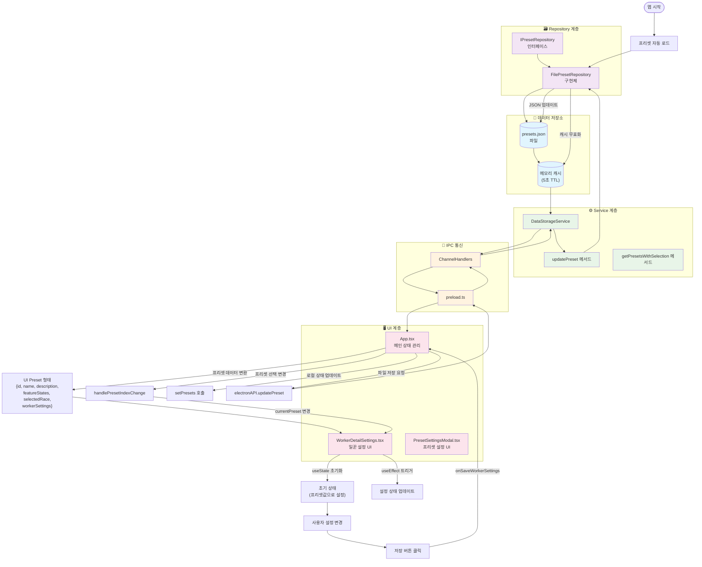

# 프리셋 데이터 플로우 시스템

> **작성일**: 2025-01-30  
> **버전**: 1.0  
> **담당**: Claude Code Assistant

## 📋 개요

StarcUp 프로젝트에서 사용자 프리셋 데이터가 저장, 로드, 관리되는 전체 플로우를 문서화합니다. 이 시스템은 Repository 패턴을 기반으로 하여 파일 기반 저장소에서 데이터베이스로의 전환을 쉽게 할 수 있도록 설계되었습니다.

## 🏗️ 시스템 아키텍처

### 전체 플로우차트



## 🔄 주요 데이터 플로우

### 1. 앱 시작 시 프리셋 로드

```
presets.json → FilePresetRepository → DataStorageService 
→ IPC → App.tsx → UI 표시
```

**상세 과정:**
1. `App.tsx` 컴포넌트 마운트
2. `useEffect`에서 `loadPresets()` 실행
3. `electronAPI.getPresetsWithSelection()` 호출
4. IPC를 통해 `DataStorageService.getPresetsWithSelection()` 실행
5. `FilePresetRepository.loadAll()` 호출
6. `presets.json` 파일 읽기 및 캐시 저장
7. `StoredPreset` → `IPreset` → `UI Preset` 변환
8. React 상태 업데이트 및 UI 렌더링

### 2. 일꾼 설정 저장

```
WorkerDetailSettings → App.tsx → electronAPI → IPC 
→ DataStorageService → FilePresetRepository → presets.json
```

**상세 과정:**
1. 사용자가 일꾼 설정 변경
2. `WorkerDetailSettings`에서 저장 버튼 클릭
3. `onSaveWorkerSettings(presetId, workerSettings)` 호출
4. `App.tsx`에서 로컬 상태 업데이트
5. `electronAPI.updatePreset()` 호출
6. IPC를 통해 `DataStorageService.updatePreset()` 실행
7. `FilePresetRepository.update()` 호출
8. 메모리 캐시 무효화 및 JSON 파일 업데이트

### 3. 프리셋 전환

```
사용자 선택 → App.tsx (currentPreset 변경) 
→ WorkerDetailSettings (useEffect) → UI 업데이트
```

**상세 과정:**
1. 사용자가 다른 프리셋 선택
2. `handlePresetIndexChange()` 호출
3. `currentPresetIndex` 상태 변경
4. `currentPreset` 계산 결과 변경
5. `WorkerDetailSettings`의 `useEffect` 트리거
6. 일꾼 설정 상태들 업데이트
7. UI 리렌더링으로 새 설정값 표시

## 📊 데이터 구조 및 변환

### 데이터 타입 계층

```typescript
// 1. Repository 계층 (파일 저장용)
interface StoredPreset {
  id: string
  name: string
  description: string
  featureStates: boolean[]
  selectedRace: 'protoss' | 'terran' | 'zerg'
  workerSettings?: WorkerSettings
  createdAt: Date
  updatedAt: Date
}

// 2. Service 계층 (IPC 통신용)
interface IPreset {
  id: string
  name: string
  type: 'game'
  data: {
    description: string
    featureStates: boolean[]
    selectedRace: 'protoss' | 'terran' | 'zerg'
    workerSettings?: WorkerSettings
  }
  createdAt: Date
  updatedAt: Date
}

// 3. UI 계층 (React 컴포넌트용)
interface Preset {
  id: string
  name: string
  description: string
  featureStates: boolean[]
  selectedRace: 'protoss' | 'terran' | 'zerg'
  workerSettings?: WorkerSettings
}
```

### 일꾼 설정 구조

```typescript
interface WorkerSettings {
  workerCountDisplay: boolean        // 일꾼 수 출력 (기본: true)
  includeProducingWorkers: boolean   // 생산 중인 일꾼 포함 (기본: false)
  idleWorkerDisplay: boolean         // 유휴 일꾼 수 출력 (기본: true)
  workerProductionDetection: boolean // 일꾼 생산 감지 (기본: true)
  workerDeathDetection: boolean      // 일꾼 사망 감지 (기본: true)
  gasWorkerCheck: boolean            // 가스 일꾼 체크 (기본: true)
}
```

## 🗃️ Repository 패턴 구현

### 인터페이스 정의

```typescript
interface IPresetRepository {
  loadAll(): Promise<PresetCollection>
  findById(id: string): Promise<StoredPreset | null>
  create(preset: CreatePresetRequest): Promise<StoredPreset>
  update(preset: UpdatePresetRequest): Promise<StoredPreset>
  delete(id: string): Promise<void>
  updateSelectedIndex(index: number): Promise<void>
  getSelected(): Promise<StoredPreset | null>
  initialize(): Promise<void>
}
```

### 파일 기반 구현체

**주요 특징:**
- **JSON 파일 저장**: `{userData}/StarcUp/presets.json`
- **메모리 캐싱**: 5초 TTL로 성능 최적화
- **최대 3개 프리셋**: 제한 관리
- **기본 프리셋 자동 생성**: 첫 실행 시

**저장 위치:**
```
{userData}/StarcUp/presets.json
```

**파일 구조:**
```json
{
  "version": "1.0.0",
  "maxPresets": 3,
  "selectedPresetIndex": 0,
  "lastUpdated": "2025-01-30T10:30:00.000Z",
  "presets": [
    {
      "id": "preset-1234567890-abc123",
      "name": "Default Preset",
      "description": "기본 프리셋 - 일꾼 기능만 활성화됨",
      "featureStates": [true, false, false, false, false],
      "selectedRace": "protoss",
      "workerSettings": {
        "workerCountDisplay": true,
        "includeProducingWorkers": false,
        "idleWorkerDisplay": true,
        "workerProductionDetection": true,
        "workerDeathDetection": true,
        "gasWorkerCheck": true
      },
      "createdAt": "2025-01-30T10:00:00.000Z",
      "updatedAt": "2025-01-30T10:30:00.000Z"
    }
  ]
}
```

## 📡 IPC 통신 시스템

### 등록된 채널

| 채널명 | 기능 | 요청 데이터 | 응답 데이터 |
|--------|------|-------------|-------------|
| `data:save-preset` | 프리셋 생성 | `{userId, preset}` | `{success, id?}` |
| `data:load-preset` | 프리셋 조회 | `{userId, presetId}` | `{success, data?}` |
| `data:get-presets` | 프리셋 목록 | `{userId}` | `{presets}` |
| `data:delete-preset` | 프리셋 삭제 | `{userId, presetId}` | `{success}` |
| `data:update-preset` | 프리셋 업데이트 | `{userId, presetId, updates}` | `{success}` |
| `data:get-selected-preset` | 선택된 프리셋 조회 | `{userId}` | `{success, data?}` |
| `data:set-selected-preset` | 프리셋 선택 변경 | `{userId, index}` | `{success}` |
| `data:get-presets-with-selection` | 프리셋과 선택정보 | `{userId}` | `{success, data?}` |

### preload.ts 노출 API

```typescript
window.electronAPI = {
  // ... 기존 API들 ...
  
  // 프리셋 관리 API
  savePreset: (userId: string, preset: any) => Promise<any>
  loadPreset: (userId: string, presetId: string) => Promise<any>
  getPresets: (userId: string) => Promise<any>
  deletePreset: (userId: string, presetId: string) => Promise<any>
  updatePreset: (userId: string, presetId: string, updates: any) => Promise<any>
  getSelectedPreset: (userId: string) => Promise<any>
  setSelectedPreset: (userId: string, index: number) => Promise<any>
  getPresetsWithSelection: (userId: string) => Promise<any>
}
```

## 🎯 UI 계층 최적화

### React 상태 관리

**문제**: 컴포넌트 마운트 시 기본값 → 프리셋값 전환으로 인한 깜빡임

**해결**: useState 초기화 함수 활용
```typescript
// ❌ 문제가 있던 코드
const [workerCountDisplay, setWorkerCountDisplay] = useState(true);

useEffect(() => {
  setWorkerCountDisplay(currentPreset?.workerSettings?.workerCountDisplay ?? true);
}, [currentPreset]);

// ✅ 개선된 코드
const [workerCountDisplay, setWorkerCountDisplay] = useState(() => 
  currentPreset?.workerSettings?.workerCountDisplay ?? true
);

useEffect(() => {
  setWorkerCountDisplay(currentPreset?.workerSettings?.workerCountDisplay ?? true);
}, [currentPreset]);
```

### 성능 최적화 포인트

1. **메모리 캐싱**: 5초 TTL로 반복 파일 읽기 방지
2. **useState 초기화**: 불필요한 리렌더링 방지
3. **useEffect 의존성**: 정확한 의존성 배열로 최적 업데이트
4. **IPC 호출 최소화**: 로컬 상태 우선, 필요시에만 파일 저장

## 🔮 확장 가능성

### 데이터베이스 전환

Repository 패턴 덕분에 쉬운 전환 가능:

```typescript
// 새로운 구현체 추가
class DatabasePresetRepository implements IPresetRepository {
  // SQLite, PostgreSQL 등 데이터베이스 구현
}

// DataStorageService에서 구현체만 교체
constructor() {
  this.presetRepository = new DatabasePresetRepository(); // 변경점
}
```

### 추가 기능 확장

1. **다른 기능 설정**: 인구수, 유닛, 업그레이드, 빌드오더
2. **프리셋 공유**: 클라우드 동기화
3. **백업/복원**: 설정 내보내기/가져오기
4. **프리셋 템플릿**: 미리 정의된 전략별 프리셋

## 🔧 개발 가이드

### 새로운 설정 추가 시

1. **StoredPreset 인터페이스 확장**
2. **기본값 정의** (FilePresetRepository)
3. **UI 컴포넌트 구현**
4. **useState 초기화 함수 적용**
5. **저장/로드 로직 연동**

### 디버깅 팁

- 콘솔 로그 활용: 각 계층별 데이터 흐름 추적
- 브라우저 개발자 도구: React 상태 확인
- JSON 파일 직접 확인: 저장된 데이터 검증

## 📚 관련 문서

- [Instructions.md](../Instructions.md) - 전체 프로젝트 개요
- [Architecture/README.md](./README.md) - 아키텍처 전반
- [Development/commit-guidelines.md](../Development/commit-guidelines.md) - 커밋 가이드라인

---

**마지막 업데이트**: 2025-01-30  
**다음 업데이트 예정**: 다른 기능 설정 확장 시